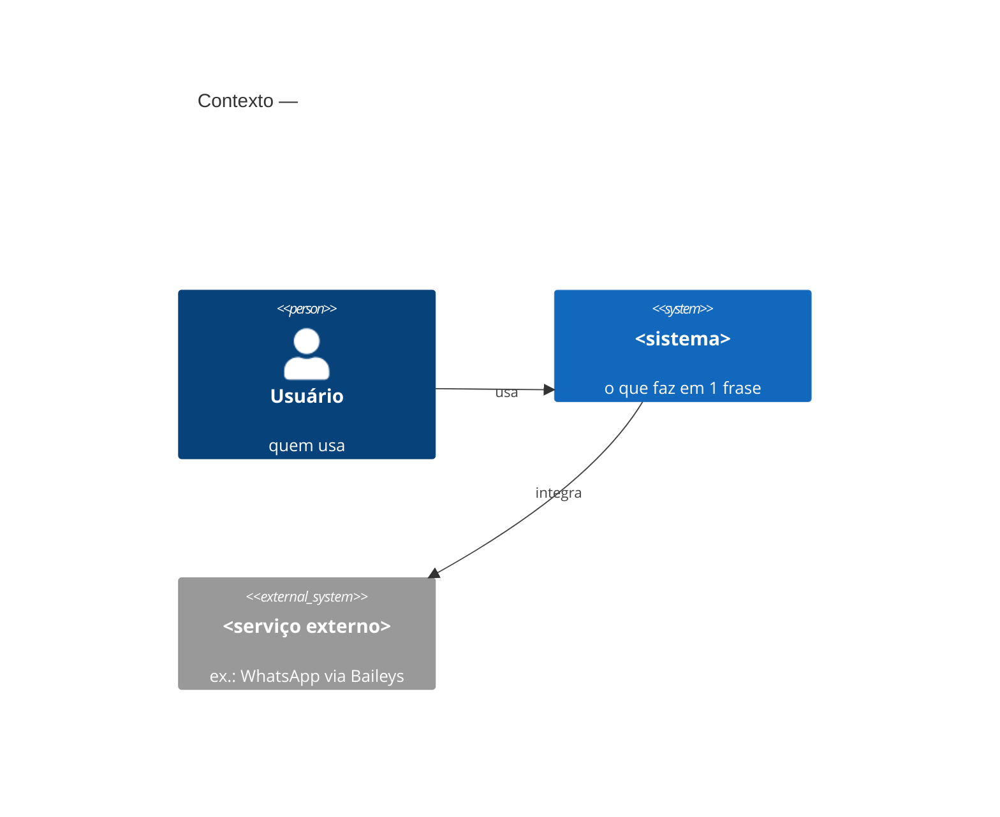
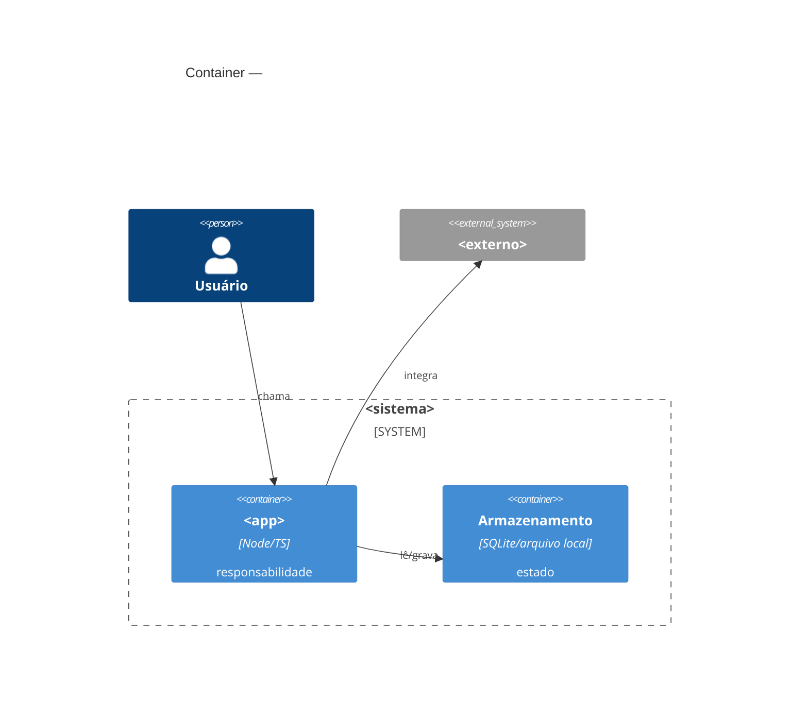
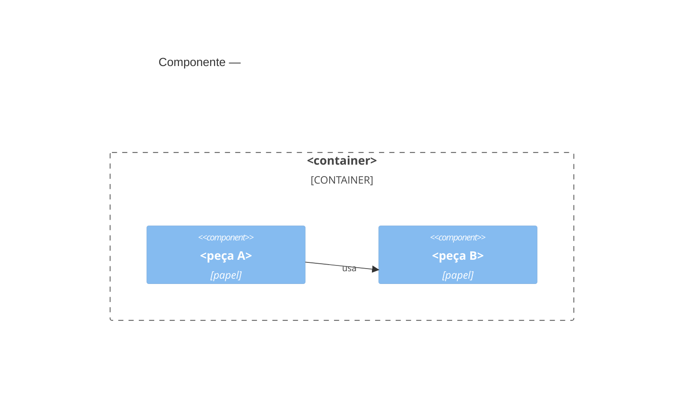
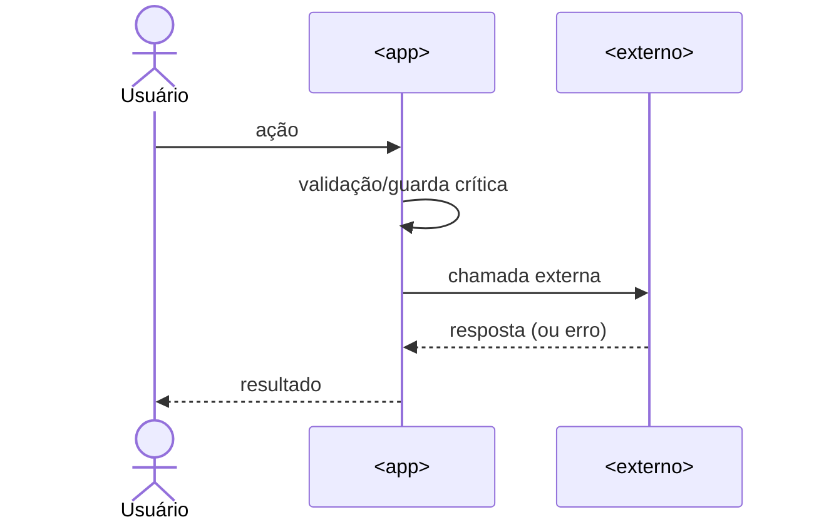

# C4 em Mermaid — desenho de arquitetura como código

Entrega os **3 primeiros níveis do C4** (Contexto, Container, Componente) mais um
**diagrama de sequência**, tudo como **código Mermaid** — que renderiza nativo no
GitHub, no VS Code e nos artifacts, sem PlantUML/servidor/.NET. É a escolha
lowcost. Não desenhe o nível 4 (Código) — é ruído para revisão humana.

## Onde gravar

```
docs/<slug>/diagrams/
├── context.mmd      # C4 nível 1 — o sistema e seus vizinhos
├── container.mmd    # C4 nível 2 — os blocos executáveis internos
├── component.mmd    # C4 nível 3 — as peças de UM container relevante
└── sequence.mmd     # o fluxo crítico ao longo do tempo
```

Além dos `.mmd`, **embuta cada diagrama** como bloco ` ```mermaid ` dentro do
`TECHNICAL.md` (assim o doc é auto-suficiente e renderiza no GitHub).

## Regra de ouro (anti-inchaço)

- Um diagrama por nível. Só os elementos que importam para a decisão.
- Contexto: no máximo ~7 caixas. Container: ~7. Componente: só do container mais
  crítico (não faça de todos). Sequência: só o fluxo crítico (o que pode dar
  errado / é irreversível), não o caminho feliz trivial.
- Se um diagrama não cabe legível numa tela, o desenho está complexo demais —
  simplifique a solução, não o diagrama.

## Templates (copie e adapte)

### Contexto (nível 1)


### Container (nível 2)


### Componente (nível 3 — só do container crítico)


### Sequência (fluxo crítico)


## Dica de custo

Mantenha os `.mmd` versionados no git — é o "desenho vivo" mais barato possível:
diff-ável, revisável e sem nenhuma ferramenta. Referência de abordagem C4-as-code:
robtaylor/c4-diagrams (PlantUML) e o C4 model oficial; aqui usamos Mermaid pela
renderização nativa e custo zero.
